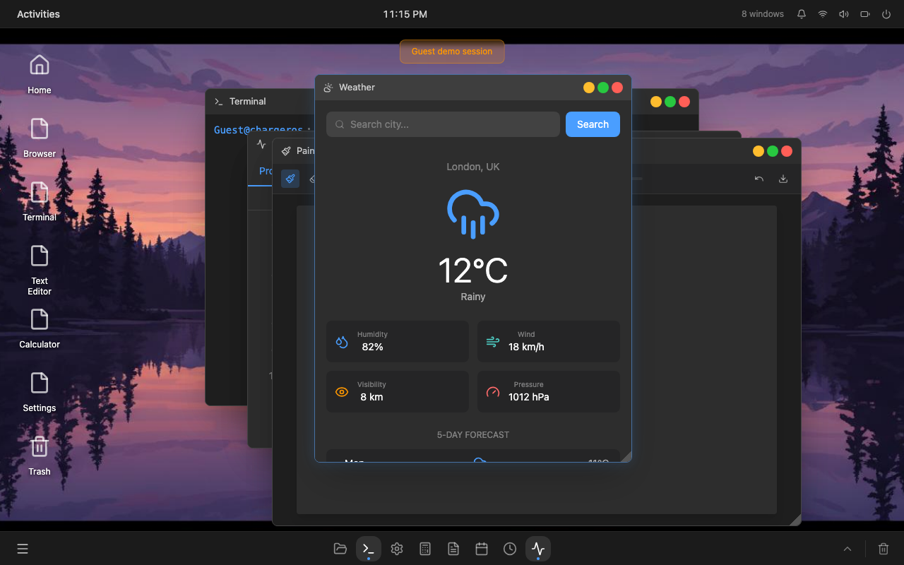
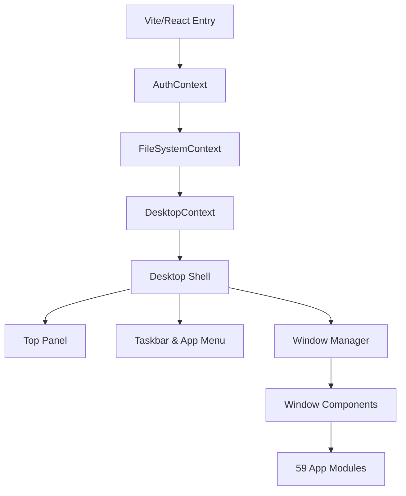

# ChargerOS

<p align="center">
  
</p>

<p align="center">
  
  
  
  
  
</p>

---

ChargerOS is an Ubuntu-inspired web desktop operating system simulation built by **Flamechargerr**. It recreates a Linux desktop environment inside the browser. It is built using modern frontend engineering practices and includes a login screen, wallpaper customizer, top panel, taskbar, search-enabled app launcher, draggable window manager, local persistence, a virtual filesystem, a simulated terminal, and a suite of **59 built-in applications**.

> [!NOTE]
> ChargerOS is a client-side web application and operating system simulation. It is not a bootable Linux distribution, custom kernel, or ISO file.

---

## 🚀 Key Features

* **🎛️ Draggable Window Manager**: Support for dragging, resizable dimensions, minimize, maximize, restore, close, and dynamic z-index focus ordering.
* **📂 Virtual Unix Filesystem**: Simulated file system with directories like `/home`, `/etc`, `/usr`, `/var`, `/tmp`. All files, folders, and custom configurations are persisted using browser `localStorage`.
* **📟 Interactive Terminal**: Run standard commands like `ls`, `cd`, `pwd`, `mkdir`, `touch`, `cat`, `rm`, `neofetch`, `cowsay`, `fortune`, `tree`, `history`, and `help`.
* **🧩 59-App Suite**: Fully registered frontend apps grouped into 8 categories—ranging from a code editor and database viewer to playable retro games.
* **🖥️ Desktop Shell**: Contextual menus, dynamic top panel widgets (clock, open window indicators, settings drawer), taskbar shortcuts, and trash folder.

---

## 🛠️ Tech Stack

* **Frontend**: [React 19](https://react.dev/), [TypeScript 5.9](https://www.typescriptlang.org/), [Vite 7](https://vite.dev/)
* **Styling**: [Tailwind CSS 3.4](https://tailwindcss.com/), [Radix UI Primitives](https://www.radix-ui.com/), [Lucide React Icons](https://lucide.dev/)
* **Persistence**: Browser `localStorage` API
* **Graphics & Tools**: HTML5 Canvas, SVG, ChartJS/Recharts

---

## ⚙️ Technical Architecture

ChargerOS uses a modular provider-consumer architecture to keep the OS shell decoupled from individual app modules.



### 1. `AuthContext`
Handles session login, logout, and guest sessions. Any username/password is accepted for demonstration purposes.

### 2. `FileSystemContext`
Maintains a virtual directories tree. Exposes filesystem methods like `readFile`, `writeFile`, `createFolder`, `deleteFile`, and `listDir` that are shared by the File Manager, Terminal, Text Editor, and other productivity tools.

### 3. `DesktopContext`
Manages the OS window state: which windows are open, their position coordinates, width/height bounds, active z-index focus, and icon placement on the desktop grid.

---

## 📦 App Suite Directory

ChargerOS includes **59 custom apps** organized into functional categories:

| Category | Apps Included |
| --- | --- |
| **📁 System** | Files, Terminal, Settings, Calculator, Text Editor, Calendar, Clock, System Monitor, Disk Usage, Backup |
| **🌐 Internet** | Browser, Email, Chat, Weather, RSS Reader, FTP Client, Remote Desktop |
| **💼 Office** | Writer, Spreadsheet, Presentation, Notes, Todo List, PDF Viewer, Dictionary |
| **🎨 Graphics** | Image Viewer, Paint, Screenshot, Color Picker, Icon Viewer, Font Viewer, ASCII Art, QR Code |
| **🎵 Media** | Music Player, Video Player, Camera, Sound Recorder, CD Burner, Media Converter |
| **💻 Development** | Code Editor, Git Client, Database, API Tester, Regex Tester |
| **🎮 Games** | Chess, Solitaire, Minesweeper, Snake, Tetris, Tic Tac Toe, 2048 |
| **🔧 Utilities** | Password Generator, Unit Converter, Scientific Calc, Network Tools, Task Manager, File Search, Archive Manager, System Info, Help |

---

## 🏎️ Getting Started

### Prerequisites

Make sure you have Node.js 20+ installed.

### Installation

1. Clone the repository:
   ```bash
   git clone https://github.com/Flamechargerr/ChargerOS.git
   cd ChargerOS
   ```

2. Install dependencies:
   ```bash
   npm install
   ```

3. Run the development server:
   ```bash
   npm run dev
   ```
   Open `http://localhost:3000/` in your browser.

### Build and Production Deployment

To build a minified production bundle:
```bash
npm run build
```

To preview the production build locally:
```bash
npm run preview
```

---

## 🗺️ Roadmap & Future Improvements

- [ ] **Lazy Loading & Code Splitting**: Move app modules to dynamic imports to optimize the initial bundle size.
- [ ] **Safe Formula Evaluator**: Replace `eval` inside the Spreadsheet and Scientific Calculator apps with a secure expression parser (e.g. `expr-eval` or mathjs).
- [ ] **Persisted User Profiles**: Segment the virtual filesystem database to support separate login users and guests.
- [ ] **Mobile & Tablet Responsiveness**: Enhance drag/resize handlers for touch events and optimize window placement on small screen sizes.
- [ ] **Automated Testing**: Introduce Playwright end-to-end testing for critical shell features (window drag, resize, filesystem persistence).
